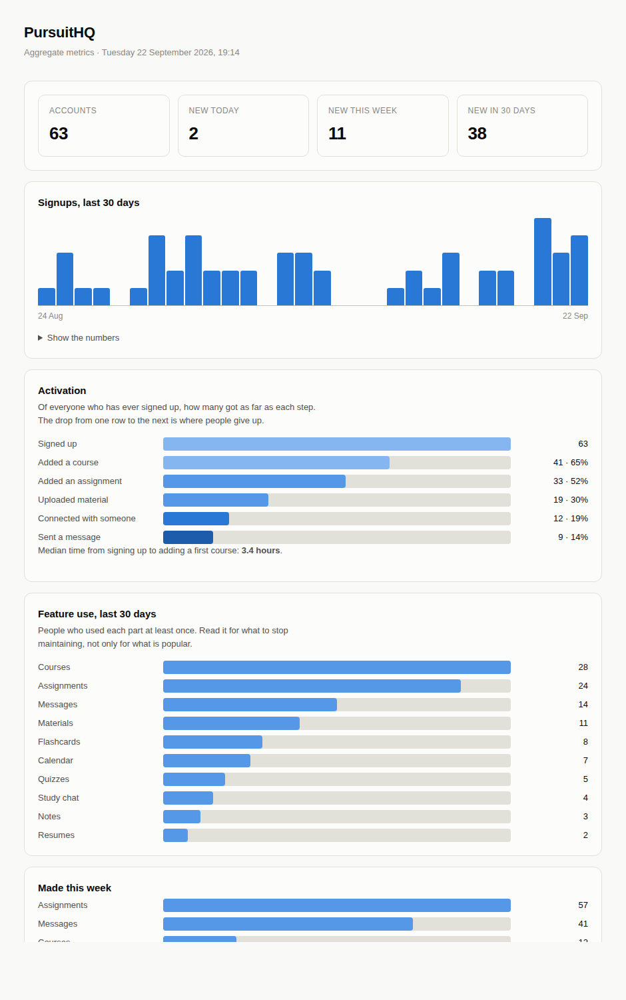

# PursuitHQ Metrics

A local, read-only metrics dashboard for [PursuitHQ](https://pursuit-hq.com).

Run it, and it reads the production database, writes `metrics.html`, and opens
it in your browser. Nothing is deployed. Nothing listens on a port.



## Why a separate tool

An operator dashboard is the most sensitive surface an application has — it is
the one screen designed to look at everybody at once. Building it into the app
means shipping that capability to production, where a mistake in one
authorisation check exposes it. Keeping it out here means the deployed API has
no such endpoint to get wrong.

Two properties keep it honest, and both are structural rather than intentions:

**1. It connects as a read-only database role.** Not "it does not write" — it
*cannot*. The role is granted `SELECT` and nothing else.

**2. Every query is an aggregate.** No statement in this repository selects a
name, an email address, a message, a file name, or any row belonging to one
identifiable person. Counts, sums and percentiles only.

It also does not reference the application's own data layer. Every query is
hand-written SQL, so what this tool can see is auditable by reading one small
project — rather than being bounded by which navigation properties somebody
remembered not to follow.

A "most active students" table is exactly the feature that gets added later
because it seems harmless. It is deliberately absent. If it is ever added, the
privacy policy has to change with it.

## Metrics

| Section | What it answers |
|---|---|
| Headline counts | How many accounts, and how many arrived today, this week, this month |
| Signups over 30 days | Is growth happening, and when |
| Activation funnel | How far new people get: signed up → added a course → added an assignment → uploaded material → connected → messaged |
| Median time to first course | How long before somebody does the thing the product is for |
| Feature use, 30 days | Distinct people per feature — read it for what to *stop* maintaining |
| Made this week | Courses, assignments, messages, materials and the rest |
| Needs attention | Open reports, reports this week, total stored bytes |

The activation funnel is the one to watch. The drop between two rows is where
people give up, and it is the only number here that says whether the product is
understood rather than merely visited.

## Setup

### 1. Create the read-only role

In the Neon SQL editor, against the application's database:

```sql
CREATE ROLE metrics_reader WITH LOGIN PASSWORD 'pick-a-long-random-password';

GRANT CONNECT ON DATABASE neondb TO metrics_reader;
GRANT USAGE ON SCHEMA public TO metrics_reader;
GRANT SELECT ON ALL TABLES IN SCHEMA public TO metrics_reader;

-- So tables added by future migrations are readable too, without having to
-- remember to come back here.
ALTER DEFAULT PRIVILEGES IN SCHEMA public GRANT SELECT TO metrics_reader;
```

That role can read and do nothing else — no `INSERT`, `UPDATE`, `DELETE` or
`DROP`. A bug in this tool, or a leak of its password, cannot damage the
database.

### 2. Point the tool at it

Take the .NET connection string from Neon and replace the username and password
with `metrics_reader` and the password chosen above.

```
setx PURSUITHQ_METRICS_DB "Host=...;Database=neondb;Username=metrics_reader;Password=...;SSL Mode=Require;Channel Binding=Require"
```

`setx` persists it for future terminals — **open a new terminal afterwards**, as
the one you typed it into will not see it.

The connection string is never committed. It lives in that environment variable
and nowhere else.

## Running

```
cd PursuitHQ.Metrics
dotnet run
```

It prints where it wrote the report and opens it.

## Not yet measurable

Three metrics need the application to record something it currently does not:

- **Deletions and churn.** When an account is deleted the row is gone, so there
  is nothing left to count. Needs a small append-only event log holding a date
  and no personal data.
- **Daily and weekly active users, and retention cohorts.** There is no
  `LastSeenAt` on the user. One nullable column, touched on authenticated
  requests.
- **AI usage and spend.** The counter lives in memory and resets on restart, so
  there is nothing to report on. Moving it to a table would fix the reporting
  and the leaky daily cap at the same time.

Worth adding once it is clear which numbers get looked at.

## Built with

.NET 10 · Npgsql · no other dependencies. The report is a single HTML file with
inline CSS, no scripts and no network requests — it opens from disk with nothing
to load, and will still open in five years.

## Licence

MIT.
